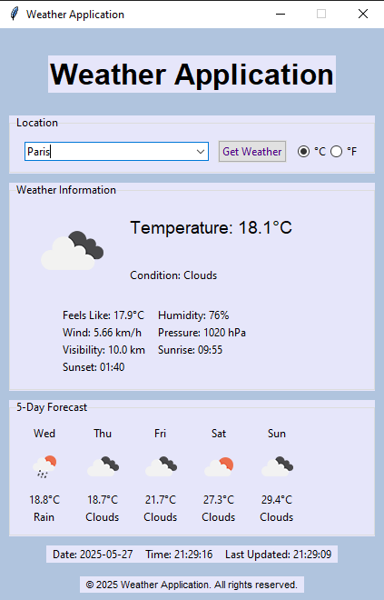

# 🌤️ Weather Application

<div align="center">

  [](https://www.python.org/downloads/)
  [](LICENSE)
  []()
  []()


*A modern, user-friendly weather application built with Python and Tkinter that provides real-time weather information for any city worldwide.*


</div>

<table>
<tr>
<td></td>
<td></td>
</tr>
</table>

## ✨ Key Features

### 🌡️ Weather Information
- Real-time weather data display
- Current temperature and conditions
- Detailed weather metrics:
  - Humidity
  - Wind speed and direction
  - Atmospheric pressure
  - Visibility
  - Sunrise and sunset times
  - "Feels like" temperature

### 📊 Advanced Features
- 5-day weather forecast with detailed predictions
- Dynamic weather icons that change based on conditions
- Dynamic background colors reflecting current weather
- Excel-based weather data logging system
- Date and time display with automatic updates
- User-friendly interface with intuitive controls

## 🛠️ Technical Requirements

### System Requirements
- Python 3.8 or higher
- Active internet connection
- OpenWeatherMap API key
- 100MB free disk space
- 4GB RAM recommended

### Dependencies
- `requests==2.31.0`
- `pandas==2.1.0`
- `openpyxl==3.1.2`
- `Pillow==10.0.0`
- `python-dateutil==2.8.2`
- `numpy==1.24.3`

## 📥 Installation Guide

1. **Clone the Repository**
   ```bash
   git clone https://github.com/sabbirahmad12/weather-application.git
   cd weather-application
   ```

2. **Set Up Virtual Environment**
   ```bash
   # Create virtual environment
   python -m venv venv

   # Activate virtual environment
   # For Windows:
   venv\Scripts\activate
   # For Linux/Mac:
   source venv/bin/activate
   ```

3. **Install Dependencies**
   ```bash
   pip install -r requirements.txt
   ```

## ⚙️ Configuration

1. **Get OpenWeatherMap API Key**
   - Visit [OpenWeatherMap](https://home.openweathermap.org/users/sign_in)
   - Create a free account
   - Navigate to your account dashboard
   - Generate an API key
   - Replace `API_KEY` in `main.py` with your key

## 📁 Project Structure
```
weather_app/
├── data/                  # Excel logs and data storage
├── main.py                # Main application file
├── background_manager.py  # Background color management
├── requirements.txt       # Project dependencies
├── README.md              # Project documentation
└── sc/                    # Application screenshots
```

## 🚀 Usage Guide

1. **Launch the Application**
   ```bash
   python main.py
   ```

2. **Using the Application**
   - Enter city name in the search box
   - Click "Get Weather" or press Enter
   - View current weather and forecast
   - Check Excel logs in the data folder

## 📊 Data Logging

The application automatically logs weather data to Excel files:
- Location: `data/weather_logs.xlsx`
- Logged Information:
  - Timestamp
  - City name
  - Temperature
  - Weather conditions
  - Humidity
  - Wind speed
  - Pressure
  - Visibility

## ⚠️ Important Notes

- Ensure stable internet connection for real-time updates
- Keep your API key secure and don't share it
- Weather data updates every 5 minutes
- Excel logs are stored in the data folder
- Application requires Python 3.8 or higher

## 🤝 Contributing

Contributions are welcome! Please feel free to submit a Pull Request.
